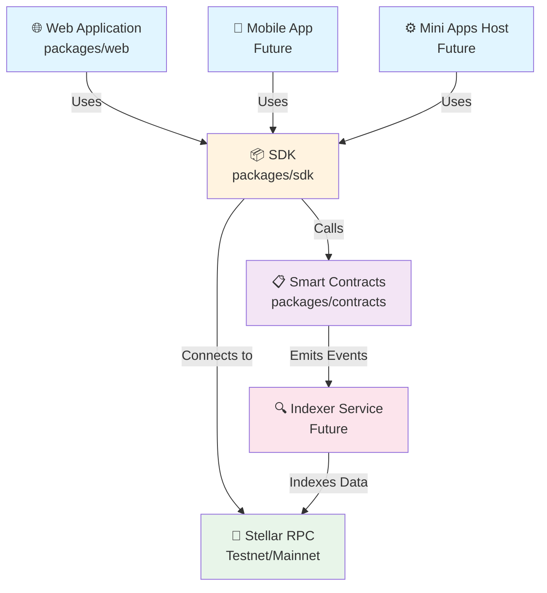
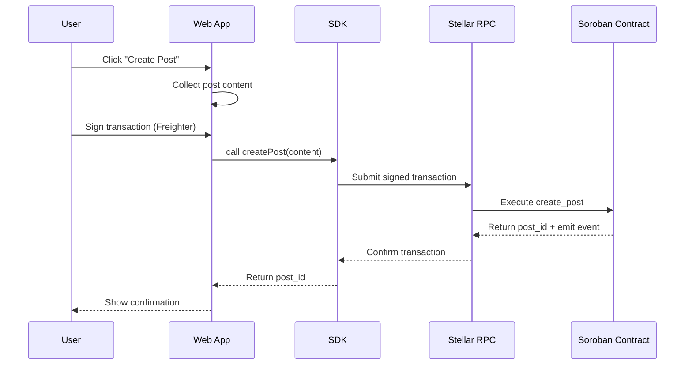
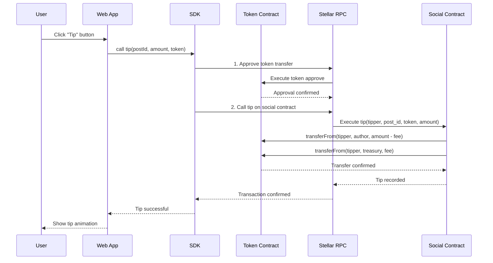

# Kovara Architecture

This document describes the high-level architecture of Kovara, a decentralized social finance platform built on Stellar with Soroban smart contracts.

## System Overview



## Component Architecture

### 1. Frontend Layer

#### Web Application (`packages/web`)

- **Framework**: Next.js 14 with React 18
- **Type Safety**: TypeScript
- **Styling**: CSS Modules
- **Wallet Integration**: Freighter API for Stellar wallet
- **Testing**: Playwright for E2E, Jest for unit tests

**Key Pages:**

- `/` - Landing/Home feed
- `/explore` - Discovery page
- `/post/[id]` - Single post view
- `/profile/[address]` - User profile
- `/pools` - Community pools
- `/new` - Create new post

**Core Components:**

- `WalletProvider` - Context-based wallet state management via `useWallet()` hook
- `Feed` - Post feed component with pagination
- `PostCard` - Individual post display
- `ConnectWallet` - Wallet connection UI
- `CreatePost` - Post composition interface

**Custom Hooks:**

- `useWallet()` - Wallet state: connection, balance, address
- `useFeed()` / `useFollowingFeed()` - Feed data fetching and pagination
- `usePoolContract()` - Community pool interactions
- `usePools()` - Pool listing and state

### 2. Backend Layer

#### Soroban Smart Contracts (`packages/contracts`)

- **Language**: Rust with `soroban-sdk`
- **Build System**: Cargo workspace
- **Test Coverage**: Unit tests in `test.rs`

**Primary Contract: `KovaraContract`**

**Core Features:**

- **Profiles**: Register and update creator profiles with username and token address
- **Follow Graph**: Track following/followers with pagination support (50 per page max)
- **Posts**: Create, delete, and like posts with metadata storage
- **Tipping**: Transfer SEP-41 tokens to post authors with protocol fee split
- **Community Pools**: Multi-signature managed token deposits and withdrawals
- **Blocking**: Block/unblock users and prevent blocked users from following

**Key Functions:**

```
Profile Management:
  - set_profile(user, username, creator_token)
  - get_profile(user)
  - get_profile_count()

Follow Graph:
  - follow(follower, followee)
  - unfollow(follower, followee)
  - get_following(user, offset, limit) → Vec<Address>
  - get_followers(user, offset, limit) → Vec<Address>

Posts:
  - create_post(author, content) → u64 (post_id)
  - get_post(id) → Option<Post>
  - delete_post(author, post_id)
  - get_posts_by_author(author, offset, limit) → Vec<u64>

Interactions:
  - like_post(user, post_id)
  - has_liked(user, post_id) → bool
  - get_like_count(post_id) → u64
  - tip(tipper, post_id, token, amount)

Pools:
  - create_pool(admin, pool_id, token, initial_admins, threshold)
  - pool_deposit(depositor, pool_id, token, amount)
  - pool_withdraw(signers, pool_id, amount, recipient)
  - get_pool(pool_id) → Option<Pool>
  - get_pool_admins(pool_id) → Vec<Address>
  - add_pool_admin(signers, pool_id, new_admin)
```

#### SDK (`packages/sdk`)

- **Purpose**: Typed client library for contract interaction
- **Type Safety**: TypeScript type definitions
- **Contract Bindings**: Generated from contract interface
- **Consumer**: Used by all frontend applications

### 3. Data Flow

### User Creates a Post



### User Tips a Post



### Indexer Flow (Future)

```
1. Listen to contract events on Stellar RPC
2. Parse emitted events (PostCreated, Tipped, UserFollowed, etc.)
3. Index data in database (current state: mock data only)
4. Serve indexed data via REST/GraphQL API
5. Frontend queries indexer for optimized data retrieval
```

## Technology Choices and Rationale

### Smart Contracts: Soroban (Rust)

- **Why**: Native Stellar integration, type-safe, high performance
- **Trade-off**: Learning curve, but excellent for financial contracts

### Frontend: Next.js

- **Why**: React ecosystem, built-in SSR, excellent TypeScript support, edge deployment
- **Alternative Considered**: Vue, but React has larger ecosystem

### Wallet Integration: Freighter API

- **Why**: Official Stellar wallet for browser, seamless UX
- **Limitation**: Browser-only (desktop, mobile web via browser)

### Testing: Playwright + Jest

- **Why**: Playwright for realistic browser testing, Jest for unit tests
- **Note**: Unit test infrastructure currently minimal; expanding with Issues #349

## Deployment Topology

### Testnet Environment

```
+-----------+         +----------+
| Web App   | ------> | Stellar  |
| (Vercel)  |         | Testnet  |
+-----------+         +----------+
                            |
                      +-----+-----+
                      |           |
                  Contracts   Indexer
                  (Testnet)  (if active)
```

### Mainnet Environment (Future)

```
+-----------+         +----------+
| Web App   | ------> | Stellar  |
| (Vercel)  |         | Mainnet  |
+-----------+         +----------+
                            |
                      +-----+-----+
                      |           |
                  Contracts   Indexer
                  (Mainnet)   (if active)
```

## Development Workflow

### Local Development

```bash
# Install dependencies
pnpm install

# Start web app dev server
pnpm -C packages/web dev

# Run contract tests
pnpm -C packages/contracts test

# Run E2E tests
pnpm -C packages/web test:e2e
```

### Testing Strategy

**Unit Tests:**

- Contract logic via Soroban test framework
- Web hooks and utilities via Jest

**Integration Tests:**

- E2E tests via Playwright (wallet connection, transactions)
- Contract interaction via SDK

**Deployment Verification:**

- Contract deployment to Testnet
- Web app deployed to Vercel
- E2E test suite runs against Testnet

## Key Architectural Decisions

### 1. Paginated Follow Graph

- **Decision**: Limit to 50 items per page
- **Reason**: Prevent DoS via large data requests
- **Cost**: Slightly more complex client logic

### 2. Protocol Fee Split

- **Decision**: Fee split between author and treasury on tips
- **Reason**: Sustainable project funding while rewarding creators
- **Implementation**: Configurable fee percentage (0-10,000 basis points)

### 3. M-of-N Pool Admin Model

- **Decision**: Multi-signature required for pool withdrawals
- **Reason**: Security and decentralized pool governance
- **Tradeoff**: Slightly increased UX complexity

### 4. SEP-41 Token Support

- **Decision**: All tipping and pools use standard token contracts
- **Reason**: Composability and ecosystem interoperability
- **Limitation**: Requires users to manage token balances

## Security Considerations

### Smart Contract Security

- **Input Validation**: All parameters validated before state changes
- **Access Control**: Signer checks on sensitive operations
- **Error Handling**: Clear error messages for debugging
- **Testing**: Unit test coverage of core flows

### Web Application Security

- **CSP Headers**: Content Security Policy to mitigate XSS
- **Input Sanitization**: Post content checked for length (1-280 chars)
- **Wallet Integration**: Freighter handles key management securely
- **HTTPS Only**: All communication encrypted in production

### Recommended Security Enhancements

- Formal contract audits before mainnet deployment
- Rate limiting on sensitive endpoints
- CAPTCHA for post creation to prevent spam
- Reputation scoring system for better content filtering

## Performance Considerations

### Scalability

- **Pagination**: 50-item pages prevent large transfers
- **Event Indexing**: Offloads read operations to indexer service
- **Client-Side Caching**: Hook state prevents redundant queries

### Optimization Opportunities

- Implement feed caching strategy
- Use Stellar soroban event filtering for efficient indexing
- Consider CDN for static assets
- Lazy-load post details on demand

## Future Enhancements

1. **Mobile App**: React Native client using same SDK
2. **Mini Apps**: Ecosystem of small apps (games, tools) using SDK
3. **Indexer Service**: Full event indexing with GraphQL API
4. **Reputation System**: Scoring based on follows, tips, engagement
5. **DAO Governance**: Decentralized decision-making for protocol changes
6. **Payment Channels**: Micro-tipping without blockchain confirmation
7. **Content Moderation**: Community flagging and review system

## Links to Component READMEs

- [Smart Contracts README](../packages/contracts/README.md)
- [SDK README](../packages/sdk/README.md)
- [Web App README](../packages/web/README.md)
- [Design System](./design/README.md)
- [Indexer Design](./indexer/INDEXER_DESIGN.md)
